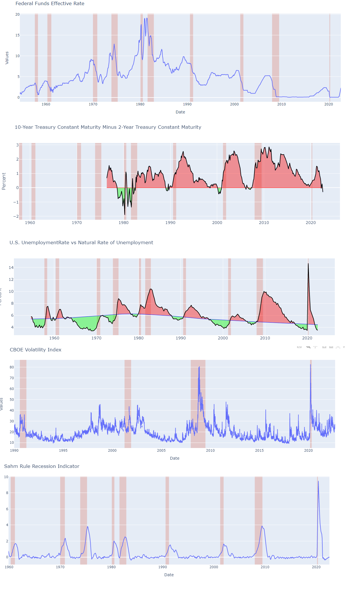

# API-s_FFederal-Reserve-Economic-Data-FRED-St.-Louis-Fed

Federal Reserve Economic Data (FRED) is a database maintained by the Research division of the Federal Reserve Bank of St. Louis that has more than 816,000 economic time series from various sources. They cover banking, business/fiscal, consumer price indexes, employment and population, exchange rates, gross domestic product, interest rates, monetary aggregates, producer price indexes, reserves and monetary base, U.S. trade and international transactions, and U.S. financial data. The time series are compiled by the Federal Reserve and many are collected from government agencies such as the U.S. Census and the Bureau of Labor Statistics. (https://en.wikipedia.org/wiki/Federal_Reserve_Economic_Data#:~:text=Federal%20Reserve%20Economic%20Data%20(FRED,time%20series%20from%20various%20sources.)
